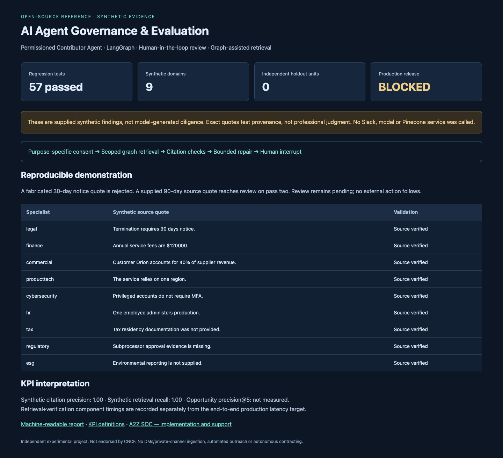
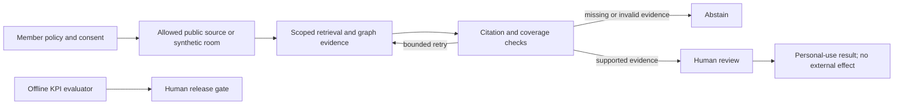

# Permissioned Contributor Agent

**Open-source AI agent governance and evaluation with human-in-the-loop approval, LangGraph workflows, and graph-assisted retrieval.**

AI agents need clear permission boundaries before they read data or recommend action. This Python reference implementation demonstrates purpose-specific consent, revocation, evidence validation, bounded evaluation loops, and human review. Its first use case is a read-only GitHub contributor opportunity agent; a separate synthetic due-diligence example exercises nine specialist domains.

[Quick start](#quick-start) · [AI agent KPIs](docs/ai-agent-evaluation.md) · [Loop engineering](docs/loop-engineering.md) · [MCP security](docs/mcp-security.md) · [GraphRAG tradeoffs](docs/graphrag-retrieval.md) · [A2Z SOC](https://a2zsoc.com)

> Experimental reference implementation. Not endorsed by CNCF. No DMs/private channels, automated outreach, autonomous contracts, or production deployment. A successful test suite is not a compliance certification or an accuracy guarantee.

## What works today

| Capability | Implemented behavior | Validation boundary |
|---|---|---|
| AI agent governance | Member/source policy checks; expiring and revocable purpose-specific consent | Trusted local process; no production identity service |
| AI agent evaluation | Regression tests, computed KPIs, independent-data checks, human release gate | Synthetic quality metrics are labeled separately |
| Human-in-the-loop workflows | LangGraph interrupt, payload-bound review, replay/expiry checks | In-memory checkpoints; no restart durability |
| Loop engineering | Bounded retries, context and time checks, abstention, constrained tuning proposals | Cooperative time checks; no self-modification |
| Graph-assisted retrieval | Lexical seeds plus one authorized document-graph hop | No embeddings or Microsoft GraphRAG indexing pipeline |
| GitHub contributor discovery | Public repositories; bounded issues query; exclude assigned issues and pull requests | No personalized language-fit or opportunity-quality validation |
| Slack official MCP boundary | Public-only scopes and channel metadata checks before content reads | OAuth host and live tool-schema binding remain unimplemented |
| Due-diligence integration | Pinned upstream graph/citation components; nine synthetic specialist findings | Not a live 13-agent model run |
| Pinecone query boundary | Server-derived namespace and allowed-document filter, tested with fake index | No live Pinecone index or vector benchmark |

## Quick start

Python 3.12+. The core CLI has no third-party runtime dependencies:

```sh
git clone https://github.com/AAH20/permissioned-contributor-agent.git
cd permissioned-contributor-agent
python3 -m contributor_agent demo
```

Run the full offline LangGraph demo and evaluation:

```sh
python3 -m venv .venv
. .venv/bin/activate
python -m pip install -r requirements-demo.lock
python -m pip install --no-deps -e .
python scripts/evaluate.py
python scripts/build_report.py
```

Open `evidence/report.html` for the synthetic report. No API keys, LLM calls, Slack connection or Pinecone service are needed. Telemetry tracing is disabled by the evaluation entry point. The package does not automatically collect data or send messages.

For the explicitly consented public-GitHub pilot, see [the pilot guide](docs/pilot.md). Source availability can change after collection; a human must recheck the issue before acting.

## Evidence, including the failure we fixed

A bounded public-GitHub smoke test examined 23 issues across Kubernetes Website, Prometheus and Envoy. The baseline proposed five open issues. Browser inspection showed an assigned issue; after adding assignment filtering, all 23 sampled issues were excluded and the agent abstained. This is an availability-filter lesson, not proof that those projects lack opportunities. See the [sanitized test summary](evidence/github-smoke-summary.json).

The synthetic diligence demo rejects an altered 30-day notice quote, accepts the supplied source's 90-day quote on pass two, and pauses for human review. This is deterministic fixture replay, not model-generated professional advice.



Current regression results and computed synthetic metrics are in [evaluation.json](evidence/evaluation.json). Production release remains **blocked**: there are no independent holdout cases or measured personal recommendation relevance.

## KPIs and release criteria

Every KPI has a definition, denominator, collection scope, target and owner in the [evaluation scorecard](docs/ai-agent-evaluation.md). Empty denominators return `null`, not 100%.

| KPI | Proposed production gate | Current evidence |
|---|---:|---|
| Unauthorized reads/writes, tenant leaks, approval bypasses | 0 observed in the evaluated dataset | Synthetic boundary tests; not an operational guarantee |
| Unsupported critical claims / missed critical findings | 0 observed | Controlled synthetic fixtures only |
| Citation precision | 1.00 | Computed for supplied synthetic quotes |
| Retrieval recall | ≥0.95 | Computed for known synthetic documents |
| Recommendation precision@5 | ≥0.80 | Not measured |
| Independent holdout units / critical units | ≥200 / ≥50 | 0 / 0 |
| End-to-end compute latency p95 | ≤30 seconds | Full workflow target; synthetic component timings separate |
| Release authority | Human approval, no automatic promotion | Evaluator returns a review recommendation only |

## Architecture



Contributor consent does not authorize commercial diligence. Each purpose has a separate grant. Future agent-to-agent relationship, procurement and contract workflows require additional authorization, storage isolation and professional review; they are not implemented in this release.

## Documentation

- [AI agent evaluation and KPI definitions](docs/ai-agent-evaluation.md)
- [Evolution parameters and loop engineering](docs/loop-engineering.md)
- [GraphRAG, LangGraph, NetworkX, Qdrant and Pinecone tradeoffs](docs/graphrag-retrieval.md)
- [Slack MCP security and consent boundaries](docs/mcp-security.md)
- [CNCF community policy references](docs/community-policies.md)
- [Regulated-community design limits](docs/regulated-communities.md)
- [Search terminology and discoverability](docs/discoverability.md)

## Deployment and support

For implementation, private deployment, and managed support discussions, visit **[A2Z SOC](https://a2zsoc.com)**. The OSS example is usable without an account, tracking registration, or a paid service. Commercial scope and customer data are kept outside this repository.

## License and attribution

Apache-2.0 for this project's original code. Selected components from [AAH20/A2Z_due-diligence-agents](https://github.com/AAH20/A2Z_due-diligence-agents), originally developed by Zohar Babin, retain their license and attribution. See [NOTICE](NOTICE), [third-party details](contributor_agent/_vendor/dd/NOTICE.md), and the pinned provenance manifest. Referenced CNCF documents retain their original rights; they are not relicensed here.
